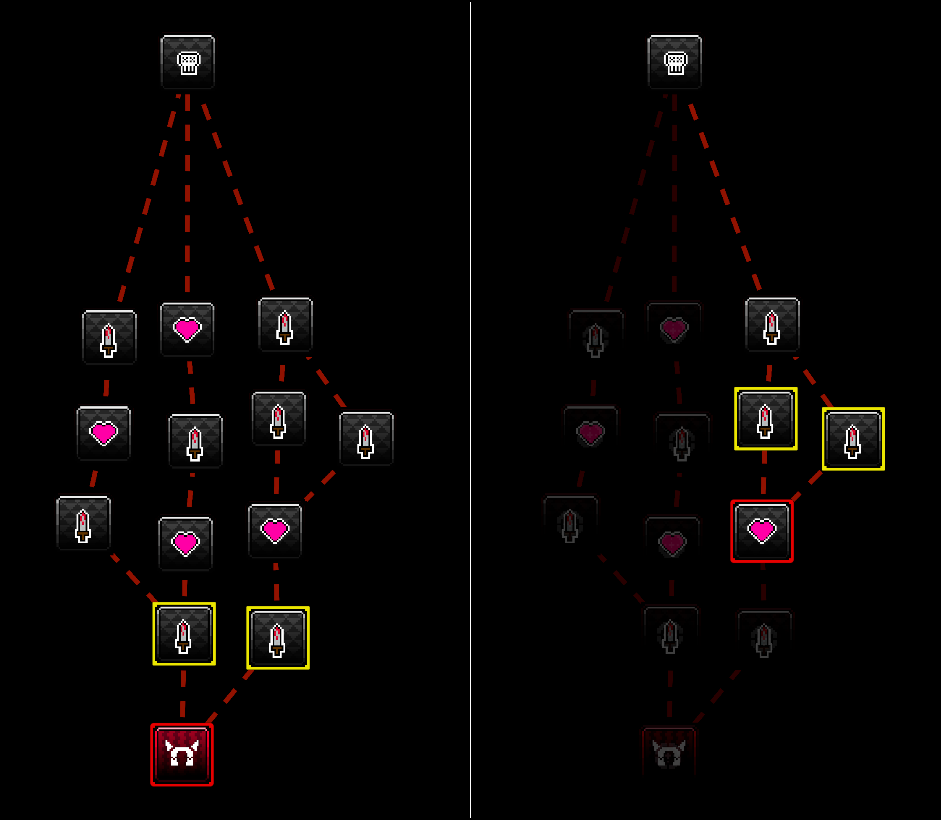

# Unity Crusade Map
 Node map for roguelike games  
   

# Example of Use
1. Create a ScriptableObject of `ScriptableObjects/CrusadeMap/TreeMapStructure` and add to Gameobject with component `CrusadeMap`.
2. Change settings of `TreeMapStructure`
3. Play Scene
